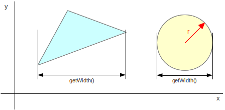
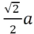
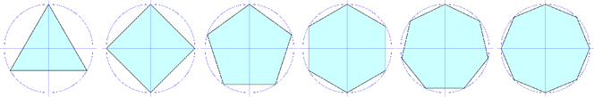
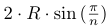
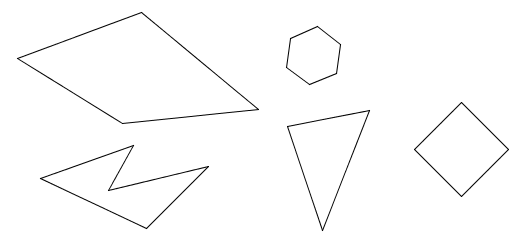

## První iterace

Cvičení zaměřené na základní práci s atributy, metodami a na instanciaci tříd (bez vlastních konstruktorů).

1.  Upravte třídu `Vertex2D` následujícím způsobem:
    *   Přidejte do třídy tzv. "gettery" a "settery", konkrétně metody:
        *   `double getX()` a `double getY()` pro získání hodnot atributů,
        *   `void setX(double newX)` a `void setY(double newY)` pro nastavení hodnot atributů.
    *   Upravte viditelnost atributů, aby splňovaly podmínky zapouzdření.
    *   Metodu `printInfo()` přejmenujte na `toString()`.
2.  Vytvořte třídu `Triangle` v balíku `cz.muni.fi.pb162.project.geometry`.
    *   Trojúhelník se skládá ze tří vrcholů typu `Vertex2D` a bude mít jeden atribut typu **pole vrcholů**.
    *   Třída bude mít defaultní (implicitní) konstruktor.
    *   Metoda `Vertex2D getVertex(int index)` vrátí _index_-tý vrchol.
        Jestli je _index_ menší než 0 nebo větší než 2, vrátí metoda hodnotu `null`.
        Když je _index_ 0, vrátí první vrchol, jestli 1 tak druhý, jestli 2 pak třetí.
    *   Obdobně `void setVertex(int index, Vertex2D vertex)`.
    *   Metoda `String toString()` vrátí řetězec:

        ~~~~
        "Triangle: vertices=[ax, ay] [bx, by] [cx, cy]"
        ~~~~
        Využijte metodu `toString()` z třídy `Vertex2D`.
    * Trojúhelník budeme moci rozdělit na tři menší trojúhelníky:

        
        *Původní trojúhelník (vlevo) a rozdělený na podtrojúhelníky (vpravo).*
    *   Implementujte proto tyto metody:
           *   Třída `Triangle` bude obsahovat atribut typu `Triangle[]`.
               V něm budou uloženy tři menší (na obrázku - černé) trojúhelníky. Na začátku je tento atribut nenainstanciovaný (nastavený na null),
               protože rozdělení zatím nebylo provedeno.
           *   Metoda `boolean isDivided()` zjistí, jestli již došlo k rozdělení trojúhelníka (menší trojúhelníky byly vytvořeny).
           *   Metoda `getSubTriangle(int index)` vrátí `index`-tý podtrojúhelník, kde `index` je číslo mezi 0 a 2.
               Pokud je `index` mimo tento rozsah, nebo pokud trojúhelník není dosud rozdělen, vrátí metoda `null`.
           *   Metoda `boolean divide()` rozdělí trojúhelník, tj. vytvoří tři menší trojúhelníky, uloží je do atributů a vrátí `true`.
               Pokud již trojúhelník byl rozdělen (`isDivided()` vrátí `true`), metoda neprovede nic a jen vrátí `false`.
               Vrcholy menších trojúhelníků jsou vždy v polovině délky stran původního trojúhelníka.
               Střed hrany (úsečky) má souřadnice _[(x1+x2)/2, (y1+y2)/2]_,
               kde _[x1, y1]_ a _[x2, y2]_ jsou vrcholy trojúhelníka.
           *   Je doporučeno si na souřadnice středu hrany mezi dvěma vrcholy vytvořit privátní metodu.

3.  Upravte třídu `Demo` následujícím způsobem:
    *   Třídu přesuňte do balíku `cz.muni.fi.pb162.project.demo`.
    *   Zrušte vytváření proměnných i výpis textu.
    *   Třída vytvoří trojúhelník se souřadnicemi _[-100, 0] [0, 100] [100, -100]_.
    *   Na std. výstup vypíše informace o trojúhelníku. Po spuštění by výstup měl vypadat takto:

        ~~~~
        Triangle: vertices=[-100.0, 0.0] [0.0, 100.0] [100.0, -100.0]
        ~~~~
5.  Správnost implementace si ověřte jednotkovými testy.
    Pak spustíte třídu `Draw` v balíčku `demo`, zobrazí se vám trojúhelník se třemi podtrojúhelníky.

6.  Zdokumentujte třídy pomocí [_JavaDoc_](https://en.wikipedia.org/wiki/Javadoc).
    Pak zkontrolujte, jestli vám přešel checkstyle zavoláním příkazu:

        mvn clean install -Dcheckstyle.fail=true

## Druhá iterace

Cvičení zaměřené na definici vlastních konstruktorů a jejich přetěžování.

1.  Ve třídě `Vertex2D`:
    *   Třída bude mít definovaný konstruktor o dvou parametrech `x` a `y`.
    *   Udělejte třídu `Vertex2D` neměnnou (*immutable*) tím, že odstraníte settery a změníte metodu `move`.
        Metoda `move` bude mít návratový typ `Vertex2D` a bude vracet nový vrchol.
    *   Přidejte metodu `double distance(Vertex2D vertex)`, která vezme jiný 2D bod jako vstupní parametr a vrátí
        jeho eukleidovskou vzdálenost. Vzdálenost bodů se vypočítá jako:
    
    *   Pokud je vstupní argument `null`, pak metoda vrátí hodnotu `-1.0` jako indikátor chyby
    (vzdálenost je vždy >= 0).

    > V Javě se odmocnina vypočítá pomocí statické metody `Math.sqrt()`.

2.  Vytvořte třídu `Circle`.
    *   Třída bude mít konstruktor se dvěma parametry (v tomto pořadí): _střed_ typu `Vertex2D` a _poloměr_ typu `double`.
        Atributy budou neměnné.
    *   Třída bude mít dále *bezparametrický konstruktor*, který vytvoří jednotkovou kružnici se středem
        v počátku souřadného systému (střed `[0, 0]`, poloměr `1`).
    *   **Bezparametrický konstruktor bude volat předchozí konstruktor** s parametry a předá mu potřebné hodnoty.
    *   Pro poloměr a střed vygenerujte gettery `getRadius()` a `getCenter()`.
    *   Metoda `toString` bude vracet řetězec ve formátu:

            "Circle: center=[<x>, <y>], radius=<radius>"

        kde `<x>` a `<y>` jsou hodnoty příslušných souřadnic středu a `<radius>` je hodnota poloměru.

3.  Upravte třídu `Triangle` následujícím způsobem:
    *   Konstruktor bude mít *3 parametry* typu `Vertex2D`.
    *   Udělejte třídu neměnnou tím, že odstraníte metodu set.
    *   Přidejte metodu `boolean isEquilateral()`, která vrátí `true`, jestliže je trojúhelník rovnostranný.
        Protože pracujeme s reálnými čísly, nelze jednoduše porovnávat délky stran pomocí `d1 == d2`.
        Je nutné použít test, který bude považovat dvě reálná čísla za shodná, pokud se liší jen málo:

            Math.abs(d1-d2) < 0.001

        kde `0.001` je tolerovaná absolutní odchylka.
    *   Vytvořte přetíženou metodu `boolean divide(int depth)`, která rozdělí trojúhelník na podtrojúhelníky.
        Výsledkem bude [_Sierpińského trojúhelník_](http://en.wikipedia.org/wiki/Sierpinski_triangle):
             
             *Sierpińského trojúhelníky hloubky 0 až 4.*
        *   Parametr `depth` udává hloubku dělení. Nula značí žádné dělení (jsme na konci rekurze), 1 znamená,
            že dojde k jednomu rozdělení původního trojúhelníka, atd.
        *   Jestli je `depth` nula, rekurze se ukončí vrácením `false` (trojúhelník na úrovni nula je již rozdělen).
        *   Záporná hodnota je považována za chybu, kterou metoda indikuje tím, že vrátí `false`.
        *   Metoda použije existující metodu `divide()`, a pak zavolá `divide(int depth)` na svých podtrojúhelnících
            s parametrem `depth` o jedna nižší a pak vrátí `true`.

4.  Upravte třídu `Demo` tak, aby šla zkompilovat.

5.  Po spuštění třídy `Draw` se na obrazovce vykreslí *Sierpińského trojúhelníky* hloubky 4 a kolem něho červená kružnice.

## Třetí iterace

Cvičení zaměřené na statické metody, implementaci a použití rozhraní.

1.  Vytvořte třídu `SimpleMath` v balíku `cz.muni.fi.pb162.project.utils`.
    *   Třída bude implementovat pouze _statické_ metody.
    *   Statická metoda `Vertex2D minX(Vertex2D[] vertices)` vrátí vrchol s nejmenší X-ovou souřadnicí.
    *   Statická metoda `Vertex2D minY(Vertex2D[] vertices)` vrátí vrchol s nejmenší Y-ovou souřadnicí.
    *   Obdobně pro metody `maxX` a `maxY`.

    > Existují statické metody `Math.min` a `Math.max`.

2.  Upravte třídy `Triangle` a `Circle` tak, aby implementovaly i rozhraní `Measurable`.
    *   Výška/šířka trojúhelníku se vypočítá jako rozdíl maximální a minimální x-ové (u šířky) respektive y-ové (u výšky) souřadnice vrcholů:

        
    *   Využijte statické metody ze třídy `SimpleMath`.
    *   V metodě `isEquilateral` třídy `Triangle` používáme číslo `0.001` jako povolenou odchylku dvou reálných čísel
            (tzv. epsilon). Definujte tuto hodnotu jako **veřejnou konstantu**.

2.  V balíku `utils` vytvořte třídu `Gauger` ("měřidlo") se dvěma statickými přetíženými metodami `printMeasurement`:
    *   První metoda vezme libovolný měřitelný objekt (tj. libovolný objekt implementující rozhraní `Measurable`) a
        *   na standardní výstup vypíše _"Width: \<w\>"_, kde \<w\> je hodnota šířky,
        *   na další řádek vypíše _"Height: \<h\>"_, kde \<h\> je hodnota výšky.
    *   Druhá metoda vezme trojúhelník (objekt typu `Triangle`) a
        *   na standardní výstup vypíše informace o objektu, viz metoda `toString()`,
        *   na další řádek vypíše _"Width: \<w\>"_, kde \<w\> je opět hodnota šířky,
        *   na další řádek vypíše _"Height: \<h\>"_, kde \<h\> je opět hodnota výšky.
    *   Vyhněte se opakování kódu tím, že druhá varianta metody bude volat tu první. Pozor ale, ať nevolá sebe sama.
        Došlo by k zacyklení (`StackOverflowException`).

3.  V balíku `geometry` vytvořte třídu `Square`:
    *   První konstruktor bude obsahovat délku hrany a souřadnici levého dolního vrcholu.
    *   Druhý konstruktor bude obsahovat souřadnice středu a délku hrany.
    *   Aby šlo konstruktory ve třídě Square přetížit, musí mít druhý konstruktor parametry v opačném pořadí,
        tj. jako první je poloměr a jako druhý střed. Jinak by totiž byla signatura obou konstruktorů stejná.
    *   Třída bude implementovat rozhraní `Circumcircle` (opsaná kružnice):
    *   Poloměr opsané kružnice čtverce je
        
        kde `a` je délka hrany.
    *   Metoda `Vertex2D getVertex(int index)` vrátí vrchol na daném indexu v pořadí: 
        levý dolní, pravý dolní, pravý horní, levý horní.
        Souřadnice vrcholů čtverce vypočítáme posunutím (metoda `move`) již existujícího vrcholu.
    *   Přidejte taky getter `double getEdgeLength()`.
    *   Nezapomeňte na metodu `toString()`:

            "Square: vertices=[ax, ay] [bx, by] [cx, cy] [dx, dy]"

        přičemž zpráva obsahuje jen 3 mezery mezi vrcholy.

4.  Třída `Circle` bude taky implementovat rozhraní `Circumcircle`.
    Opsanou kružnicí je kružnice sama, proto netřeba implementovat žádné nové metody.
    Přidejte jenom anotaci `@Override`.

5.  V balíku `geometry` vytvořte třídu `Snowman`:
    *   Sněhulák se skládá ze čtyř opsaných kružnic.
    *   Konstruktor bude jako svůj první parametr brát parametr typu `Circumcircle` (spodní kružnice),
        a jako druhý parametr zmenšovací faktor (poloměru kružnice) pro kružnice nad ní (reálné číslo o rozsahu `(0..1>`).
        V případě, že vstupní parametr nebude z požadovaného rozsahu, použije se neveřejná pojmenovaná konstanta `0.8`.
    *   První kružnice je první argument konstruktoru, druhá bude položená na první s poloměrem zmenšeným o zmenšovací faktor,
        třetí kružnice bude vytvořena stejným způsobem.
    *   Celý sněhulák vznikne v konstruktoru, nebojte se ale kód rozdělit do menších privátních metod.
    *   Třídu implementujte tak, aby se dal počet koulí lehce měnit.
    *   Metoda `Circumcircle[] getBalls()` vrátí pole kružnic, od nejspodnější po nejvyšší (nejmenší).

6. Demo vytvoří čtverec se středem `[0, 0]`, délkou `100` a vypíše o něm informace na standardní výstup.

7. Draw vykreslí zelený čtverec a nad ním sněhuláka.

## Čtvrtá iterace

Cvičení zaměřené na práci s dědičností, rozhraním i výčtovým typem.

Mezi obrazce 2D geometrie patří [pravidelné mnohoúhelníky](http://cs.wikipedia.org/wiki/Pravideln%C3%BD_mnoho%C3%BAheln%C3%ADk)
 (anglicky _regular polygons_, nebo zkráceně _n-gons_).

Jsou to pravidelné hranaté konvexní objekty, které mají všechny strany stejně dlouhé.
Lze jimi opsat kružnici, která prochází všemi vrcholy.
Mezi tyto objekty patří např. rovnostranný trojúhelník, čtverec, pravidelný pětiúhelník, atd.
Dá se mezi ně zařadit i kružnice jakožto n-úhelník s nekonečně mnoha nekonečně malými hranami.
Ve skutečnosti každý pravidelný n-úhelník aproximuje kružnici &mdash; čím víc hran, tím je aproximace přesnější.

1. V balíku `geometry` vytvořte výčtový typ `Color`, definujte několik běžných barev.
   Přepište metodu `toString()`tak, že vrátí jméno barvy malými písmeny.

2.  V balíku `geometry` vytvořte třídu `GeneralRegularPolygon` implementující rozhraní `RegularPolygon` a `Colored`.
    Tato třída pak bude sloužit jako společná nadtřída pro všechny pravidelné n-úhelníky.
    *   Pravidelný n-úhelník je definován svým _středem_, _počtem hran_ a _poloměrem opsané kružnice_.
        Konstruktor proto bude mít právě tyto tři parametry.
    *   Implicitní barva je černá (`BLACK`).
    *   Délka hran se vypočítá jako:
        ,
        kde `R` je poloměr opsané kružnice a `n` je počet hran.
    *   Šířka a výška pravidelného n-úhelníka se spočítá jako průměr opsané kružnice.
    *   Metoda `toString` bude vracet:

            "<n>-gon: center=
, radius=<radius>, color=<color>"

        kde _\<n\>_ je počet hran, _\<center\>_ je střed a _\<radius\>_ je poloměr opsané kružnice
        a _\<color\>_ je barva.

        > Potřebné matematické funkce a konstanty naleznete ve třídě `java.lang.Math`.

3.  V balíku `geometry` vytvořte třídu `RegularOctagon` pro pravidelný osmiúhelník rozšiřující `GeneralRegularPolygon`.

4.  Upravte třídu `Circle` tak, aby rozšiřovala třídu `GeneralRegularPolygon`.
    *   Počet hran kružnice je konstanta _maximální celé číslo_ typu `int`.
    *   Implicitní barva kružnice je červená.
    *   Kružnice se i nadále bude dát zkonstruovat zadáním středu a poloměru.
    *   Pročistěte třídu, tj. smažte všechny nepotřebné atributy i metody, atd.
    *   Třída bude obsahovat původní metodu `toString`.
    *   Zděděná metoda `getEdgeLength()` by pro kružnici nefungovala správně, protože délka hran má být 0
         &mdash; překryjte ji.

5.  Upravte třídu `Square` tak, aby rozšiřovala třídu `GeneralRegularPolygon` a pak ji pročistěte.
    *   Odstraňte oba konstruktory a vytvořte nový konstruktor. Jeho parametr bude opsaná kružnice.
    *   Nechte metody `toString` i `getVertex` (nové souřadnice dostaneme posunutím středu opsané kružnice).

6.  Upravte třídu `Snowman`:
    *   Sněhulák nebude složen ze čtyř opsaných kružnic, ale ze **tří** pravidelných mnohoúhelníků.
    *   Konstruktor bude jako svůj první parametr brát parametr typu `RegularPolygon`.
    *   Metoda `RegularPolygon[] getBalls()` bude pak vracet pole pravidelných n-úhelníků.
    *   Můžete si vybrat, jakou třídu pro implementaci pravidelného n-uhelníka použijete. 

7. Demo vypíše pravidelný osmiúhelník se středem `[0, 0]` a poloměrem `1`.

8. Draw vykreslí [sněhuláka z opsaných kružnic i s danými polygony](https://gitlab.fi.muni.cz/pb162/pb162-course-info/wikis/draw-images#iteration-04).

## Pátá iterace

Cvičení zaměřené na práci s polem, rovností, abstraktní třídou a dědičností.

V předchozích iteracích jsme pracovali s pravidelnými n-úhelníky. Nyní si systém rozšíříme o obecnější tzv. jednoduché n-úhelníky.
To jsou obecné nepravidelné uzavřené n-úhelníky bez vzájemně se protínajících hran, jak ukazují následující příklady:

Přestože pravidelný n-úhelník je speciální případ jednoduchého n-úhelníka, v našem případě budou hierarchie tříd
_pravidelné n-úhelníky_ a _jednoduché n-úhelníky_ oddělené. Je to z toho důvodu, že pravidelné n-úhelníky máme definovány pomocí
poloměru opsané kružnice a počtu hran, zatímco jednoduché n-úhelníky musí být z principu definovány pomocí seznamu souřadnic
jednotlivých vrcholů.

1.  Definujte rovnost:
    *   dvou vrcholů (`Vertex2D`) tak, že dva vrcholy jsou stejné, pokud mají stejné souřadnice.
    *   dvou pravidelných n-úhelníků (`GeneralRegularPolygon`) tak, že jsou stejné, pokud mají
        stejný *počet hran*, *souřadnice středu*, *poloměr* a *barvu*.

    >   Nezapomeňte, že předefinováním rovnosti máte povinnost předefinovat ještě jednu metodu.

2.  V balíku `geometry` vytvořte *abstraktní* třídu `SimplePolygon` implementující rozhraní `Polygon`.
    Rozhraní `Polygon` definuje metody obecného n-úhelníka.
    Třída `SimplePolygon` bude obecná v tom smyslu, že nebude předjímat způsob uložení jednotlivých vrcholů (polem, kolekcí apod.).
    To nechá až na podtřídy. Bude tedy implementovat pouze následující metody, ostatní zůstanou neimplementované:
    *   Metoda `getHeight()` vrátí rozdíl mezi největší a nejmenší souřadnicí Y v n-úhelníku.
        Podobně `getWidth()` pro X-ové souřadnice.
    *   Metoda `toString()` vrátí řetězec:

            "Polygon: vertices = [x, y] [x, y] [x, y]"

        kde [x, y] jsou postupně všechny souřadnice vrcholů.
    *   Abstraktní třída bude mít konstruktor, který bude mít jeden parameter typu `Vertex2D[]`.
        Konstruktor zjistí, jestli samotné pole, nebo některý jeho prvek není null.
        Pokud je null, vyhodí výjimku *zlý argument* s vhodnou zprávou.

3.  Vytvořte neměnnou třídu `ArrayPolygon` rozšiřující třídu `SimplePolygon`.
    *   Souřadnice vrcholů n-úhelníka budou uloženy ve formě pole.
    *   Konstruktor bude mít jako vstupní argument pole vrcholů a ověří, jestli není pole, nebo některý jeho prvek null.
        Využijte konstruktor v abstraktní třídě.
    *   Konstruktor si vstupní pole zkopíruje (nestačí tedy pouze uložit ukazatel na pole do atributu,
        pak by šlo vytvořený objekt modifikovat, co nechceme).
    *   Metoda `Vertex2D getVertex(int i)` vrátí i-tý vrchol modulo počet vrcholů.
        V případě záporného vstupního argumentu vyhodí požadovanou výjimku **s popisem chyby**.
    *   Metoda `Collection<Vertex2D> getVertices()` vrátí všechny vrcholy n-úhelníka uložené v kolekci (je nutná konverze pole do kolekce).
    *   Implementujte rozhraní `Inverter`.
    *   Definujte metody rovnosti. Dva polygony jsou stejné, pokud jsou oba n-úhelníky stejné, tj. mají stejné souřadnice vrcholů
        se stejnou sousedností (propojením hranami). N-úhelníky tedy mohou mít i posunuté souřadnice a/nebo obrácené pořadí vrcholů.

        **Př.** *Následující trojúhelníky jsou stejné*:
        *   ([-3,-3] [ 1,-1] [ 2, 2])
        *   ([ 1,-1] [ 2, 2] [-3,-3]) /posunutí vrcholů oproti prvnímu/
        *   ([ 2, 2] [ 1,-1] [-3,-3]) /opačné pořadí vrcholů oproti prvnímu/
        *   ([ 1,-1] [-3,-3] [ 2, 2]) /kombinace obojího/

    > Při vytváření rovnosti dvou polygonů využijte metodu *invert*.

5.  Upravte třídu `Triangle` tak, aby rozšiřovala třídu `ArrayPolygon`:
    *   Konstruktor zůstane v původní podobě, tj. bude brát tři konkrétní vrcholy jako svoje vstupní argumenty a předá je konstruktoru nadtřídy v podobě pole vrcholů.
    *   Zrušte všechny metody, které lze zdědit beze změny, včetně metody `toString()`.

6. Pokud jste implementaci provedli bez chyb, tak po spuštění třídy `Draw` se na obrazovce vykreslí [fialový trojúhelník
   a uvnitř něj fialový polygon](https://gitlab.fi.muni.cz/pb162/pb162-course-info/wikis/draw-images#iteration-05)
   (v jeho tvaru nehledejte žádný smysl :wink: ).

## Šestá iterace

Cvičení zaměřené na práci s kolekcemi.

1.  Vytvořte třídu `CollectionPolygon` rozšiřující třídu `SimplePolygon`. Tato třída bude velmi podobná třídě `ArrayPolygon`.
    Lišit se bude pouze tím, že vrcholy n-úhelníka nebudou uloženy v poli, ale ve vhodné kolekci.
    Při výběru mezi seznamem a množinou myslete na to, že topologie n-úhelníka je dána pořadím vrcholů a že je povoleno
    mít více vrcholů se stejnými souřadnicemi (u jednoduchého n-úhelníka se sice nesmí křížit hrany, mohou se ale dotýkat).
    *   Třída bude mít stejný konstruktor jako `ArrayPolygon`, tj. bude brát **pole** vrcholů jako svůj vstupní argument
        a vrcholy ze vstupního pole si uloží do kolekce. Konstruktor navíc otestuje, že samotné pole ani žádný jeho prvek není null.
    *   Implementujte rozhraní `Inverter`.
        Getter by neměl modifikovat daný atribut, proto vraťte kolekci jako **nemodifikovatelnou**.
    *   Do třídy přidejte metodu `Collection<Vertex2D> removeLeftmostVertices()`, která z polygonu odebere nejlevější vrchol
        nebo vrcholy (může jich být víc, viz např. obdélník). Odebrané vrcholy vrátí v kolekci jako návratovou hodnotu.

2. Vytvořte třídu `ColoredPolygon`.
    *   Konstruktor bere polygon typu `Polygon` a barvu typu `Color`.
    *   Třída obsahuje gettery na dané atributy.
    *   Dva barevné polygony jsou (pro jednoduchost) stejné, když jde o stejnou plytkou kopii polygonu.

3.  Vytvořte třídu `Paper` implementující rozhraní `Drawable`. Jde jednoduše o papír, na který se dají kreslit polygony.
    Když na papír nakreslíme stejný polygon dvakrát, zobrazí se jenom jednou (s původní barvou). Nakreslené polygony si budeme ukládat.
    Na papír kreslete barvou, pro jednoduchost je každý polygon jednobarevný. Implicitní barva je černá.
    *   První konstruktor bude bez parametrů.
    *   Další konstruktor bude brát parametr typu `Paper` a kolekci nakreslených polygonů si zkopíruje.
    *   `changeColor(color)` změní barvu, jakou sa bude kreslit
    *   `drawPolygon(polygon)` namaluje polygon na papír (nastavenou barvou, jestli je bílá, nekreslí se nic)
    *   `erasePolygon(polygon)` odstraní polygon z papíru
    *   `eraseAll()` odstraní všechny polygony
    *   `getAllDrawnPolygons()` vrátí všechny polygony
    *   `findPolygonsWithVertex(vertex)` najde všechny polygony obsahující daný vrchol na papíře

4. Spuštění třídy `Draw`
[vykreslí barevný domeček](https://gitlab.fi.muni.cz/pb162/pb162-course-info/wikis/draw-images#iteration-06).

## Sedmá iterace

Cvičení zaměřené na práci s výjimkami a vnořenými kolekcemi.

1.  Vytvořte **hlídané** výjimky v balíku `cz.muni.fi.pb162.project.exceptions`:
    *   `TransparentColorException` je chyba při kreslení stejnou barvou na stejném podkladu,
        např. bílou tužkou na bílý papír.
    *   `MissingVerticesException` reprezentuje chybu, kdy v kolekci není dostatek vrcholů.
    *   `EmptyDrawableException` je chyba, kdy na kreslícím objektu není nic namalovaného.

    Všechny výjimky budou mít alespoň dva konstruktory, které:
    *   umožní nastavit **řetězec** s chybovou hláškou,
    *   bude mít **řetězec** i **příčinu** (cause) výjimky: tj. výjimku, která byla bezprostřední příčinou této výjimky.

2. Upravte `Paper` následujícím způsobem:
    *   Metoda `eraseAll()` volána na čistém (prázdném) papíře vyhodí `EmptyDrawableException`.
    *   Metoda `drawPolygon(polygon)` bude vyhazovat `TransparentColorException` při kreslení bílou barvou.
        Výjimka bude obsahovat textový popis s názvem dané barvy.
    *   `Paper` bude implementovat rozhraní `PolygonFactory`.
    *   Metoda `Polygon tryToCreatePolygon(List<Vertex2D>)` se pokusí vytvořit polygon z kolekce vrcholů.
        *   Pokud je vstupní argument `null`, metoda vyhodí `NullPointerException`.
        *   Pokud je vstupní kolekce prázdná, nebo obsahuje méně než 3 vrcholy,
            metoda vyhodí `MissingVerticesException`. Polygon v Euklidovském prostoru musí mít minimálně 3 vrcholy.
        *   Metoda si vstupní kolekci nakopíruje (nebude modifikovat původní kolekci).
        *   Pokud při vytváření polygonu nastane chyba `IllegalArgumentException`,
            metoda výjimku pohltí a odstraní z kolekce první výskyt vrcholu `null`.
            (Vytvořte si privátní metodu `removeFirstNull`.)
            Pokud má zbývající kolekce alespoň 3 vrcholy, zkusí to znovu, jinak vyhodí `MissingVerticesException`
            s příčinou chyby.
    *   Metoda `void tryToDrawPolygons(List<List<Vertex2D>>)` bere seznam seznamů vrcholů
        (tj. seznam polygonů uložených zatím jako kolekce vrcholů).
        *   Metoda se pokusí z každé kolekce vytvořit polygon (`tryToCreatePolygon`)
            a následně ho nakreslit (`drawPolygon`).
        *   Pokud během toho dostane `MissingVerticesException`, `NullPointerException` nebo
            `TransparentColorException`, metoda výjimky zachytí a pokusí se vytvořit a namalovat další polygon.
            Pokud se nepodařilo namalovat **žádný polygon**, vyhodí se `EmptyDrawableException`
            s příčinou **poslední** chyby.
        *   Doporučuji použít iterátor, má metodu `hasNext`.
    *   Přidejte metodu `Collection<Polygon> getPolygonsWithColor(Color color)`,
        která vrátí všechny polygony s `color` barvou.
        Můžete využít lambda streamy, konkrétně `filter`, `map`, `collect`.

3. Spuštění třídy `Draw`
[vykreslí černobílý domeček](https://gitlab.fi.muni.cz/pb162/pb162-course-info/wikis/draw-images#iteration-07).

## Osmá iterace

Cvičení zaměřené na práci s uspořádanými kolekcemi (a lambda výrazy).

V předchozích iteracích jsme vytvořili několik variant jednoduchých n-úhelníků, jejichž topologie
(pořadí propojení vrcholů hranami) bylo dáno pořadím vrcholů. Nyní si vytvoříme n-úhelník s pojmenovanými vrcholy.
Topologie bude dána abecedním pořadím názvů vrcholů.
Změnou pojmenování vrcholů tak můžeme snadno změnit topologii n-úhelníka.

Ukažme jsi příklad. Na následujícím obrázku je vlevo n-úhelník se šesti vrcholy.
Čísla u vrcholů představují pořadí, ve kterém byly vrcholy definovány a topologie je dána jejich pořadím.
Pokud je topologie dána pojmenováním vrcholů, pak stejného výsledku dosáhneme
pojmenováním vrcholů 1-6 písmeny A-F (obrázek uprostřed).
Přejmenování vrcholů ale můžeme zcela změnit topologii bez nutnosti měnit pořadí samotných vrcholů n-úhelníka
(obrázek vpravo).

1.  Definujte přirozené uspořádání na třídě `Vertex2D` v souladu s metodou `equals()`,
    tj. třídí se podle souřadnice X vzestupně a v případě shody se třídí podle Y vzestupně.

2.  Vytvořte `VertexInverseComparator` pro třídu `Vertex2D` v balíku `cz.muni.fi.pb162.project.comparator`.
    Komparátor bude vrcholy třídit **sestupně**, nejprve setřídí podle souřadnice X sestupně
    a v případě shody se třídí podle Y sestupně.

3.  Pomocí **uspořádané mapy** vytvořte třídu `LabeledPolygon` rozšiřující třídu `SimplePolygon`.
    Tato třída bude podobná třídám `ArrayPolygon` a `CollectionPolygon` s tím rozdílem,
    že vrcholy jsou uloženy pod svými názvy.

    Vrcholy jsou pojmenovány libovolným textovým řetězcem (nejčastěji jedním písmenem)
    a platí, že *jméno vrcholu je v rámci n-úhelníka unikátní*.
    N-úhelník však může obsahovat dva různě pojmenované vrcholy se stejnými souřadnicemi
    (viz situace na výše uvedeném příkladu).

    Pořadí vrcholů v n-úhelníku je dáno jejich pojmenováním (lexikograficky vzestupně).

    Třída bude mít bezparametrický konstruktor, do konstruktoru předka dejte prázné pole.
    Polygony se vytvoří pomocí metody `addVertex`.

    Implementujte nasledující rozhraní (pro více informací viz JavaDoc daného rozhraní).

    Metody z rozhraní `Polygon`:
    *   `Vertex2D getVertex(int index)` vrátí index-tý vrchol vzhledem k pořadí danému pojmenováním vrcholů.
        Pokud např. máme vrcholy "A", "B" a "C", tak nultý vrchol je "A",
        první vrchol "B", druhý vrchol "C", třetí vrchol opět "A" (modulo) apod.
    *   `int getNumVertices()` vrátí počet vrcholů v kolekci.
    *   `getVertices()` vrátí kolekci vrcholů.

    Implementujte rozhraní `Labelable`:
    *   `void addVertex(String label, Vertex2D vert)` uloží vrchol pod daným názvem.
        Název ani vrchol nesmí být `null`, jinak metoda selže s vhodnou výjimkou.
        Pokud již pod daným názvem vrchol v n-úhelníku existuje, vymění se za nový.
    *   `Vertex2D getVertex(String label)` vrátí souřadnice vrcholu se jménem `label`.
        Metoda vyhodí výjimku `NullPointerException` pokud takový vrchol neexistuje.
    *   `getLabels()` vrátí kolekci názvů vrcholů uspořádaných lexikograficky **vzestupně**.
    *   `getLabels(Vertex2D vertex)` vrátí všechna jména vrcholů se souřadnicemi `vertex`.
        Pokud žádný takový vrchol neexistuje, vrátí prázdnou kolekci.

    Implementujte rozhraní `Sortable`:
    *   `Collection<Vertex2D> getSortedVertices()` vrátí vrcholy setříděné podle přirozeného uspořádání bez duplicit.
    *   `Collection<Vertex2D> getSortedVertices(Comparator<Vertex2D> comparator)` vezme libovolný komparátor 2D vrcholů
        a vrátí vrcholy setříděné podle daného komparátoru bez duplicit.

    Nakonec metoda `Collection<Vertex2D> duplicateVertices()` vrátí množinu vrcholů,
    které jsou v polygonu vícekrát pod různým názvem.
> Pokud nevracíme novou kolekci, je potřeba vrátit kolekcii jako nemodifikovatelnou.
4.  Pokud jste implementaci provedli bez chyb, tak po spuštění třídy `Draw`
    se na obrazovce vykreslí [polygon s pojmenovanými vrcholy
    ](https://gitlab.fi.muni.cz/pb162/pb162-course-info/wikis/draw-images#iteration-08)
    podobný prostřednímu polygonu nahoře.

## Devátá iterace

Cvičení zaměřené na práci se vstupem a výstupem.

Upravte třídu `LabeledPolygon` tak, aby implementovala rozhraní `PolygonIO`.

1.  Metoda `read(InputStream)` vezme otevřený vstup obsahující pojmenované vrcholy,
    vrcholy načte a přidá je k existujícím vrcholům polygonu.
    Při jakékoliv chybě vstupu/výstupu nebo chybě formátu vstupních dat musí metoda atomicky selhat
    a vyhodit `IOException`. (atomicky = načítám všechno nebo nic)
    Formát vstupních dat je následující:
    *   Vstup je textový.
    *   Co vrchol, to jeden řádek.
    *   Každý řádek je ve formátu _"x y nazev vrcholu"_, tj. nejprve souřadnice vrcholu oddělené mezerou
        a poté název vrcholu (název může obsahovat mezery).
        Viz např. soubor _polygon-ok.txt_.

2.  Metoda `write(OutputStream)` zapíše vrcholy do daného výstupního proudu.
    Výstupní formát je stejný jako pro předchozí metodu.

3.  Metody `write(File)` a `read(File)` budou fungovat stejně jako předchozí,
    budou ale pracovat se souborem namísto vstupně-výstupního proudu.
    Vyhněte se opakování kódu!

4.  Vytvořte metodu `binaryWrite(OutputStream os)`, která bude do výstupního proudu zapisovat přímo,
    bez obalování writerem a přesto bude výsledek textový. Nápověda:
    *   Všechny souřadnice a ostatní text, který chceme zapsat binárně, musíme převést na pole bajtů.
        Třída `String` na to má přímo metodu.
    *   Je třeba vložit univerzální oddělovač konců řádků, `System.lineSeparator()`.
        Také znaky oddělovače konců řádků je nutné převést na bajty.

5.  Spuštěním třídy `Draw` se načte _polygon-ok.txt_ a [vykreslí se na obrazovce
    ](https://gitlab.fi.muni.cz/pb162/pb162-course-info/wikis/draw-images#iteration-09).

> Testy vytvářejí soubory `polygon-out.txt` a `polygon.bin` (jehož obsah by měl být při správné implementaci čitelný).
